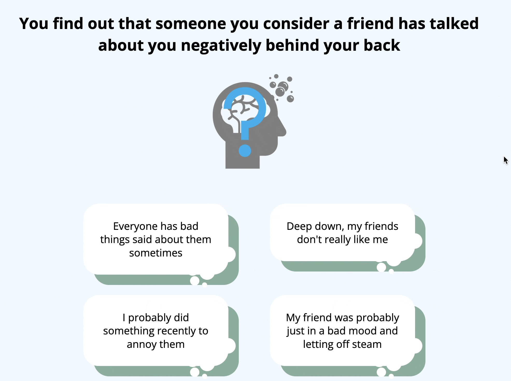

# cognitive-mechanisms-psychotherapy

Repository to hold code (and soon data) for the experiments and analyses described in the manuscript "Identifying cognitive mechanisms of psychotherapy
for common mental health problems: a computational psychiatry approach".

Play a demo version of the reward-effort decision-making task [here](https://modcomp-i1.web.app/) (no data will be collected).

Play a demo version of the causal attribution task [here](https://modcomp-ca2.web.app/) (no data will be collected).

